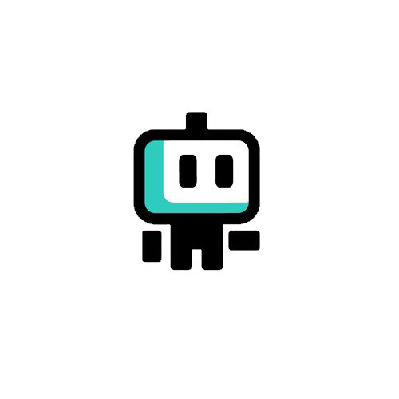

<a name="readme-top"></a>

<!-- PROJECT LOGO -->
<br />
<div align="center">
  <a href="https://github.com/Elxss/Epic-Free-Games-Alert">
    
  </a>

  <h3 align="center">Epic Games Free Games Alert via Webhook</h3>

  <p align="center">
    <br />
    <a href="https://github.com/Elxss/Epic-Free-Games-Alert">View Demo</a>
    ·
    <a href="https://github.com/Elxss/Epic-Free-Games-Alert/issues">Report Bug</a>
    ·
    <a href="https://github.com/Elxss/Epic-Free-Games-Alert/issues">Request Feature</a>
  </p>
</div>


<!-- TABLE OF CONTENTS -->
<details>
  <summary>Table of Contents</summary>
  <ol>
    <li><a href="#installation">Installation</a></li>
    </li>
    <li><a href="#roadmap">Roadmap</a></li>
    <li><a href="#contact">Contact</a></li>
  </ol>
</details>


<!-- ABOUT THE PROJECT
## About The Project

[![Product Name Screen Shot][product-screenshot]](https://example.com)

There are many great README templates available on GitHub; however, I didn't find one that really suited my needs so I created this enhanced one. I want to create a README template so amazing that it'll be the last one you ever need -- I think this is it.

Here's why:
* Your time should be focused on creating something amazing. A project that solves a problem and helps others
* You shouldn't be doing the same tasks over and over like creating a README from scratch
* You should implement DRY principles to the rest of your life :smile:

Of course, no one template will serve all projects since your needs may be different. So I'll be adding more in the near future. You may also suggest changes by forking this repo and creating a pull request or opening an issue. Thanks to all the people have contributed to expanding this template!

Use the `BLANK_README.md` to get started.

<p align="right">(<a href="#readme-top">back to top</a>)</p>
 -->


<!-- GETTING STARTED
## Getting Started

This is an example of how you may give instructions on setting up your project locally.
To get a local copy up and running follow these simple example steps. -->

### Installation

_The installation is very fast only 4 steps_

1. Python is required to run the project , you can download it directly from [https://www.python.org/](https://www.python.org/)
2. Clone the repo or install it as a zip file
   ```sh
   git clone https://github.com/Elxss/Epic-Free-Games-Alert.git
   ```
3. Then, create a webhook on the desired server on discord
4. And modify the configuration file:
    * Modify the country (FR,GB,US,...)
    * Add the webhook link
    * (Additionnal) If you want you can modify the history name
    * [ ONLY FOR VERSION GUI ] You can modify the time between request
   ```json
    {
        "discord_webhook_url": "https://discordapp.com/api/webhooks/...",
        "country": "FR",
        "history_filename": "games.txt",
        "time_between_request": 600
    }
   ```
5. This is not a step, you're done ;) now run main.py and stay cool, if you enjoyed this project please show me by sending me a little message or a star thanks.

6. [Additionnal Step] you can modify the model if you want for this modify the `model.json` file:
   * Do not change the title, description and url, if you change the url, the bot will not work.
   ```json
    {
      "content": "New Free Game Available On The Epic Games Store !",
      "embeds": [
          {
          "title": "DONT MODIFY THIS",
          "description": "DONT MODIFY THIS",
          "url": "https://store.epicgames.com/",
          "color": 31487,
          "image": {
              "url": "https://raw.githubusercontent.com/Elxss/Epic-Free-Games-Alert/main/images/logo.png"
            }
          }
      ],
      "username": "Epic Games Free Game",
      "avatar_url": "https://raw.githubusercontent.com/Elxss/Epic-Free-Games-Alert/main/images/logo.png",
      "attachments": []
    }
   ```


<p align="right">(<a href="#readme-top">back to top</a>)</p>


<!-- ROADMAP -->
## Roadmap

- [x] Get the free games available on the Epic Games via their Api.
- [x] Send webhook on discord
- [x] Multi-language Support => Just Have a Look on the 6 Step <a href="#installation">Here</a>
    - [x] English
    - [ ] French
    - [ ] Spanish

<p align="right">(<a href="#readme-top">back to top</a>)</p>

<!-- CONTACT -->
## Contact

Elxss - discord: Eliasss#8886 - elxssgitcontact@gmail.com

<p align="right">(<a href="#readme-top">back to top</a>)</p>

<p align="center">This is a Readme.md <a href="https://github.com/othneildrew/Best-README-Template/blob/master/README.md">Template</a></p>
